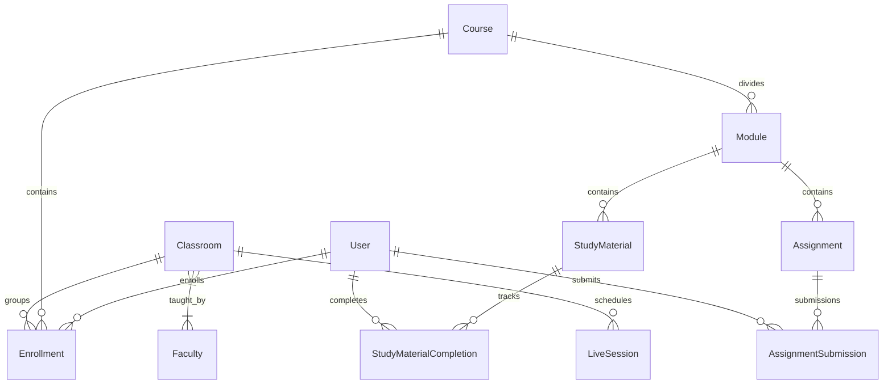

# Approach & Architecture Decisions - My Courses LMS

This document details the architectural decisions, database models, performance optimizations, and trade-offs made in the implementation of the "My Courses" student learning management platform.

---

## 1. Task Understanding

The goal is to build a student learning portal slice allowing a student to:
1. View a list of their enrolled courses, progress bars, and reminders of active sessions/missing classrooms.
2. View detailed course modules, including live lectures, study materials (videos, documents, links), assignments (due dates, evaluation scores, and feedback), and teaching faculty.
3. Track and toggle study material completion status dynamically.

We chose to implement the **Full-Stack Track (Track A + Track B)** using:
- **Backend**: Django + Django REST Framework + SimpleJWT (Auth) + SQLite (Dev) / PostgreSQL (Prod).
- **Frontend**: React + Vite + Tailwind CSS v4 + TanStack React Query + React Router.

---

## 2. Data Modeling & Schema Design

The schema has been modeled to satisfy real-world LMS relations and handle the specified edge cases:



### Critical Design Decisions
- **Classroom vs. Course**: A `Course` is the template module curriculum (e.g., CS-101). A `Classroom` is a scheduling section group (e.g., Section A - Spring 2026). A student has an `Enrollment` in a Course. If they haven't been assigned to a section yet, the `classroom` foreign key is `null`. This perfectly supports the **"not assigned to a classroom"** edge case.
- **Study Material Completion**: Modeled as a separate many-to-many join table `StudyMaterialCompletion` linking `Student` and `StudyMaterial`. This ensures isolation so Student A marking a material done doesn't affect Student B's progress.

---

## 3. Server-Side Derived Labels & Calculations

To prevent database clutter and stale display tags, critical labels are computed dynamically on query time:
- **Assignment Status Label**: Computed in `AssignmentSerializer` by inspecting submissions for the requesting student:
  - `published`: No submission row exists.
  - `submitted`: A submission row exists but `marks_obtained` is `null`.
  - `evaluated`: A submission row exists and `marks_obtained` is numeric.
- **Live Class Status**: Evaluated at model properties by checking the system's current time against `start_time` and `end_time` (`upcoming`, `ongoing`, `completed`).

---

## 4. Query Optimization (N+1 Prevention)

Unoptimized REST endpoints often trigger individual sub-queries in loops for child relations. We eliminated this N+1 issue:

### Course List Endpoint: **1 database query**
We query courses the user is enrolled in, and fetch all material count and completion counts in a single annotated statement:
```python
Course.objects.filter(id__in=course_ids).annotate(
    total_materials_count=Count('modules__study_materials', distinct=True),
    completed_materials_count=Count(
        'modules__study_materials__completions',
        filter=Q(modules__study_materials__completions__student=user),
        distinct=True
    )
)
```

### Course Detail Endpoint: **7 database queries total** (Constant, O(1))
Even for complex nested resources, the query count is completely capped:
1. Verify Enrollment (`Enrollment` check): **1 query**
2. Fetch Course with progress annotations: **1 query**
3. Prefetch Modules, Study Materials, and Assignments: **3 queries** (via Django's `prefetch_related` lookup)
4. Fetch all completed material IDs for user in course: **1 query**
5. Fetch user's submissions in course: **1 query**
6. Faculty and Live Sessions (if classroom active): **2 queries**

*All values (completion indicators, student submission marks) are mapped in-memory in Django views before serialization, resulting in zero additional database queries.*

---

## 5. UI/UX Decisions & Optimistic Updates

- **Optimistic UI Updates**: Toggling a study material checkmark immediately triggers an optimistic callback. The UI assumes success, updates the checkbox, and recalculates the progress bar. If the API request fails, it rolls back the state and presents an error toast.
- **State Persistence**: The client persists dark mode settings, last opened tab index, and the last accessed course inside `localStorage`.
- **Developer Helpers**: The login screen embeds quick-login shortcut buttons for the seeded student profiles to expedite reviewer evaluation.
